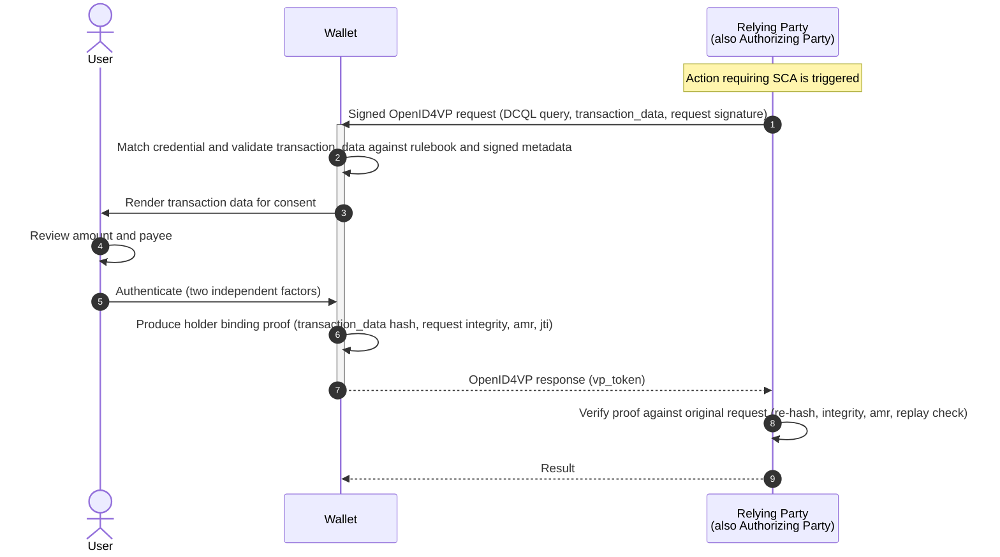
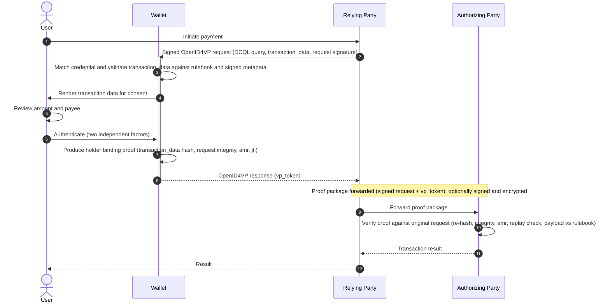

# Introduction

## Purpose of this document

This document is a conceptual introduction to **PaSO (Payments and SCA for OpenID)**. It explains the problem PaSO addresses, the background it builds on, and the ideas behind its design. It is intended for readers who are new to PaSO and want to understand *why* it exists and *how* its pieces fit together, before reading the normative specifications themselves.

It is deliberately non-normative. Where the specifications use precise requirement language ("MUST", "SHALL", etc.), this introduction paraphrases and simplifies. For exact rules, always refer to the specification documents.

## 1 Background

### 1.1 Two worlds that need to meet

Two bodies of work have matured largely in parallel:

- **Digital identity wallets and the OpenID for Verifiable Credentials family.** A wallet is an application, usually on a mobile device, that holds digital attestations (credentials) and can present them to other parties. Two protocols underpin this: [**OpenID for Verifiable Credential Issuance (OpenID4VCI)**](https://openid.net/specs/openid-4-verifiable-presentations-1_0.html), which governs how a credential is issued into a wallet, and [**OpenID for Verifiable Presentations (OpenID4VP)**](https://openid.net/specs/openid-4-verifiable-credential-issuance-1_0.html), which governs how a wallet presents a credential to a relying party. These protocols give us a device-bound key, a high-assurance authentication ceremony, and a signed presentation — exactly the primitives one needs for strong authentication.

- **European payments regulation.** Payment services legislation requires **Strong Customer Authentication (SCA)**: authentication based on at least two independent factors drawn from the categories of knowledge, possession, and inherence. For electronic payments it additionally requires **dynamic linking** — the authentication must be cryptographically tied to a specific amount and a specific payee, so that the user provably consented to *that* transaction and nothing else.

A wallet has everything needed to satisfy SCA in principle: a device-bound private key (possession), unlocked by a PIN (knowledge) or biometric (inherence), capable of signing a presentation. The difficulty is not the cryptography. It is everything *around* the cryptography that regulation cares about: what exactly the user saw, what they consented to, whether the proof can be independently re-checked later, and whether any wallet from any provider will behave consistently.

### 1.2 The gap OpenID4VP leaves open

OpenID4VP defines a parameter called `transaction_data` that lets a relying party attach transaction-specific information to a presentation request. This is the natural hook for dynamic linking. However, OpenID4VP intentionally leaves open *what that data means, how it is displayed, and what the resulting proof must contain*. Those are out of scope for a general-purpose presentation protocol.

For payments this open space is the whole problem. Without agreement on it:

- **Data is inconsistent.** Different parties send transaction details in different shapes, so a wallet cannot reliably find and display the amount and payee.
- **Consent is not demonstrably informed.** If the wallet cannot be sure it displayed the right information clearly, the user's consent is legally fragile, and liability becomes contested.
- **Proofs are not independently verifiable after the fact.** A signature over loosely defined data is hard to replay and check in a dispute.
- **Behaviour varies across wallets.** Each wallet/provider/bank combination might do something slightly different, defeating interoperability.

PaSO exists to close this gap in a focused, interoperable way.

> **A note on standardization layers.** Other initiatives have approached parts of this gap — for example, by defining a fixed set of transaction-data schemas and mandatory display rules layered onto OpenID4VP. PaSO is an alternative that addresses the *same* concerns — standardized transaction data, mandatory and faithful display, governed consent, and enforced dynamic linking — but does so through a different and more general mechanism: generic rendering driven by signed metadata, versioned type identifiers, governance rulebooks, and a verifiable proof package. Where a solution design might otherwise rely on such a fixed-schema layer, PaSO is intended to be used in its place to provide these capabilities.

## 2 What PaSO is

PaSO is a set of standards layered on top of OpenID4VCI and OpenID4VP. Its goal is to bridge wallets and payments/SCA requirements by establishing trust and a robust, regulation-aligned proof framework.

PaSO is deliberately modular. A small core defines the shared concepts; additional modules add proof packaging, rendering, metadata handling, logging, and trust. Many modules can be extended or swapped for alternatives, provided the parties involved agree on them. Although PaSO is designed with payments and SCA in mind, its mechanisms apply to any domain that needs verifiable, user-consented transactions.

The standards are organized as follows:

- **PaSO Core** — the common foundation: roles, flow types, the governance documents (rulebooks), the proof structure the wallet produces, and the rules for processing transaction data.
- **PaSO Proof** — a family of modules for producing a verifiable and replayable proof package: a metadata module, a verification module, a logging module, a status backchannel, a trust module, and a profile for SD-JWT-VC with SVG.
- **PaSO View** — how a wallet renders transaction data for the user generically, so that any transaction type is supported consistently across wallets.

The rest of this document introduces the key ideas behind these parts.

## 3 Core concepts

### 3.1 Roles

PaSO names four roles. Keeping them distinct is important, because in payments the party that *asks* for a payment is often not the party that *authorizes* it.

- **Attestation Provider** — issues PaSO credentials into the wallet. (This is the credential issuer in OpenID4VCI terms.)
- **Wallet** — stores PaSO credentials, processes transaction data, displays it to the user, and produces the proof. (This is the wallet in OpenID4VP terms.)
- **Relying Party** — sends the presentation request containing the transaction data and receives the presentation. (This is the verifier in OpenID4VP terms.)
- **Authorizing Party** — the party that ultimately verifies the proof and authorizes the transaction. It receives the proof package from the relying party and checks it against the original request. It holds trust relationships with the attestation provider and the relying party.

The separation of **Relying Party** from **Authorizing Party** is one of PaSO's defining ideas. It cleanly models the difference between, say, a merchant or merchant-side service that collects the user's consent and the bank or settlement system that actually verifies and acts on it.

### 3.2 Two flows

PaSO anticipates two common arrangements:

- **First-party flow** — one party plays attestation provider, relying party, and authorizing party at once. The wallet presents a credential back to the party that issued it. This matches the case where a bank authenticates its own customer directly.

- **Third-party flow** — the relying party is separate from the attestation provider and authorizing party. The wallet presents to the relying party, which forwards the proof package onward to the authorizing party. This matches the payment case where a merchant (or merchant-side provider) collects consent and a bank or scheme verifies and settles it.

In all cases, presentation requests are signed, and wallets reject unsigned PaSO requests. The integrity of the request the user acted on is part of the evidence.

### 3.3 Rulebooks: governance instead of hard-coding

Rather than freezing every transaction type into the protocol, PaSO uses **governance documents called rulebooks**:

- A **Credential Rulebook** defines the rules for a particular kind of PaSO credential — its attributes, display rules, issuance and verification requirements, and which transaction data types it may be used with.
- A **Transaction Data Type Rulebook** defines the meaning and structure of a specific transaction data type: what each field means, whether it is required, whether it must be shown to the user, and how it should be rendered.

This separation lets the ecosystem add new transaction types and credential types over time without changing the underlying protocol, while still keeping their meaning well-defined and stable.

### 3.4 Versioned type identifiers

Every PaSO transaction data type is named by a URN of the form:

```
urn:paso:sca:<domain>:<suffix>:<version>
```

The `<domain>` identifies the organization that owns the type (or `global` for types defined by PaSO itself), `<suffix>` names the type (for example `payment`), and `<version>` is a version number. A wallet recognizes PaSO transaction data simply by the `urn:paso:sca:` prefix.

The semantic structure of a published type is immutable: once defined, it does not change. Any change requires a new version. This is what makes a versioned-fallback strategy possible — a relying party can offer a newer type first and an older type as a fallback, so that newer and older credentials can both transact.

## 4 The proof: what gets produced and checked

### 4.1 Holder binding proof

When a wallet presents a PaSO credential together with transaction data, it produces a **holder binding proof** that cryptographically ties the user's consent to that specific presentation. Beyond the standard presentation proof, PaSO requires a defined set of claims, including:

- a fresh unique identifier for the presentation (which, in an SCA context, serves as the authentication code);
- the authentication methods used (with explicit values distinguishing strong from weaker biometrics), required to span at least two independent factor categories in a payments context;
- a hash of the exact transaction data the user consented to;
- an integrity value over the signed request the wallet received;
- an integrity value over the signed credential metadata used to display the transaction (when applicable);
- the locale that was actually shown to the user, and the wallet's version.

These claims are carried in the format-appropriate structure — a Key Binding JWT for SD-JWT-VC credentials, or device-signed data elements for mdoc credentials.

The intent is that the proof captures not just *that* the user signed, but *what they were shown* and *how they authenticated* — the elements regulation actually cares about.

### 4.2 The proof package and the Authorizing Party

In a third-party flow, the relying party forwards an unmodified **proof package** — the original signed request plus the wallet's presentation — to the authorizing party. The authorizing party then independently re-verifies everything: the request signature and relying-party identity, the credential's validity and revocation status, the holder binding proof, the SCA response claims (re-hashing the transaction data and re-computing the integrity values), and conformance of the payload to the applicable rulebook. PaSO defines a standard endpoint and an optional signed-and-encrypted envelope for this hand-off.

The key property is **independent re-verifiability**: the authorizing party does not have to trust the relying party's word; it can reconstruct and check the evidence itself.

### 4.3 Signed metadata

Plain credential metadata served by an issuer is unsigned, which means it cannot serve as evidence and a wallet cannot prove it was untampered. PaSO defines **signed credential metadata** — served as a signed JWT from a dedicated URI, bound to the credential and its issuer, and verified by the wallet every time it is used. This signed metadata is the authoritative source for which transaction data types a credential supports and how its claims are described. The proof can reference exactly which metadata was in force, via an integrity value.

### 4.4 Logging and replay

PaSO defines a **user-side audit log**. For each credential and each transaction, the wallet retains the artefacts needed to reconstruct and re-verify what happened: the request as received, the presentation as delivered, the signed metadata used, and any external resources that were resolved (with their source, content, integrity value, and retrieval time). The aim is that any past transaction can be **replayed exactly as it occurred**, including the credential choices the user made — which is invaluable for dispute resolution.

## 5 Rendering: consistent display across wallets

Informed consent depends entirely on what the user actually sees. PaSO View defines how a wallet renders transaction data **generically**, driven only by metadata — so a wallet does not need bespoke code for every transaction type.

The central ideas are:

- **Generic, metadata-driven rendering.** Each displayable claim carries a value type (for example, a currency amount, a date, an image, a frequency code, a URL, lightweight inline-formatted text, or a template that interpolates other claims). The wallet knows how to render each value type. A wallet may provide a dedicated UI for a type it specifically implements, but it must always be able to fall back to the generic renderer.

- **Display is mandatory and faithful.** Everything designated for display must be shown before the user can confirm. Parties may not use labels or hints to obscure information relevant to consent. Security hints, when provided, must be shown exactly.

- **Locale selection is deterministic.** The wallet selects a display locale according to defined matching rules, and records the locale it used in the proof — so it can later be shown precisely which text the user saw.

- **The advanced profile handles choice.** When a request offers several credential alternatives or different transaction-data entries, the wallet presents these as independent choices and updates the displayed transaction data as the user switches between credentials. A consistency property ensures these choices are genuinely independent rather than artificially coupled.

This is how PaSO turns "the user consented" into "the user demonstrably saw, in their language, exactly these details, and confirmed them."

## 6 Two integration paths for a wallet provider

A wallet provider adopting PaSO faces a choice with significant consequences for integration effort and long-term maintainability. The choice is *how the wallet learns to render a given transaction type*. PaSO supports two paths, and the **PaSO Proof: Metadata Module** is what makes the second one possible.

### 6.1 Static path: hard-coded transaction types

In the static path, the wallet provider implements support for each transaction data type directly in the wallet's code. The provider reads the relevant Transaction Data Type Rulebook, builds a dedicated consent screen for that type, and ships it as part of the wallet application.

- **Advantage:** simple to start with. For a small, fixed set of types — say, a single base payment type — a hand-built screen is straightforward and gives the provider full control over the look and feel.
- **Drawback:** it does not scale. Every new transaction data type, and every change to an existing one, requires a code change, a new wallet release, and a wait for users to update. With a growing catalogue of types — especially types defined by many different organisations under their own domains — this becomes unmaintainable. A wallet can only transact a type it has already shipped support for.

PaSO permits this path: a wallet that implements a specific rulebook *may* provide its own dedicated UI, provided it remains faithful to the rulebook's meaning.

### 6.2 Dynamic path: metadata-driven rendering

In the dynamic path, the wallet does not hard-code any transaction type. Instead, it relies on the mechanisms of the **PaSO Proof: Metadata Module** together with **PaSO View**:

- The Attestation Provider serves **signed credential metadata** that describes each supported transaction data type — its claims, which of them must be displayed, how each value should be formatted (via value types), and the localised UI labels for the consent screen.
- The wallet retrieves and verifies this signed metadata, then **renders the consent screen generically** from it, using PaSO View's value types and locale-selection rules. No transaction-type-specific code is required.

The consequence is decisive: a new transaction data type can be introduced by the issuer publishing its metadata and rulebook — **the wallet needs no update**. One generic renderer handles every present and future type, in every served locale, while still meeting PaSO's faithful-display and dynamic-linking guarantees. The signed nature of the metadata is what makes this safe: the wallet is not rendering arbitrary issuer-supplied UI, but verified, integrity-protected descriptions bound to the credential and its issuer, which also become part of the evidence (via the `metadata_integrity` value in the proof).

This is why the Metadata Module is central rather than peripheral. It converts rendering from a per-type engineering task into a one-time capability.

### 6.3 Why the dynamic path matters for real banking adoption

The dynamic path is not merely a convenience. It is effectively a precondition for using a wallet as a general authentication mechanism in existing banking applications.

The reason lies in how modern banking apps already work. Today, banks routinely show transaction-specific consent dialogs — and perform dynamic linking — for far more than payments. Regulation (PSD2) mandates SCA with dynamic linking for payment transactions, but it is common market practice for banks to apply the same transaction-bound consent pattern to a range of **non-payment** interactions as well, for example:

- logging into online banking,
- changing a daily account or card limit,
- adding or confirming a new payee,
- changing security settings.

None of these is required by PSD2 to use dynamic linking, yet banks do it because it is good security practice and users expect it. Each such interaction has its own consent screen with its own fields and wording.

If a wallet is to serve as the authentication mechanism for these interactions — as an alternative to a bank's existing in-app SCA — it must be able to display the right consent screen for *each* of them. Under the static path, every one of these interaction types, across every bank that wants to use the wallet, would require the wallet provider to ship and maintain bespoke UI. That does not scale to the diversity of banks and interaction types in the market, and it puts the wallet provider in the impractical position of having to release an update whenever any bank introduces or changes an interaction.

Under the dynamic path, each bank simply publishes signed metadata for its interaction types, and the wallet renders them generically. The wallet becomes a universal, transaction-aware consent surface for financial interactions — payment and non-payment alike — without per-bank, per-interaction engineering. For a wallet provider that intends to be adopted broadly as an SCA mechanism, this is the path that makes the proposition viable.

## 7 How the pieces fit together

A simplified end-to-end picture:

1. **Issuance.** An attestation provider issues a PaSO credential into the wallet using OpenID4VCI, and serves signed metadata describing the credential and the transaction data types it supports.
2. **Request.** A relying party sends a signed OpenID4VP presentation request that includes PaSO transaction data identified by a `urn:paso:sca:` type.
3. **Processing.** The wallet matches the request to a suitable credential, validates the transaction data against the applicable rulebook and the signed metadata, and determines what to display.
4. **Consent.** The wallet renders the transaction data faithfully in the user's locale and authenticates the user with at least two independent factors.
5. **Proof.** The wallet produces a holder binding proof that binds the user's consent to the exact transaction, request, and metadata, and returns the presentation.
6. **Verification.** The relying party forwards the unmodified proof package to the authorizing party, which independently re-verifies everything and authorizes (or rejects) the transaction.
7. **Record.** The wallet logs the request, presentation, metadata, and resolved resources, so the transaction can be replayed and audited later.

### 7.1 First-party flow

In the first-party flow, a single party fulfils the roles of Relying Party and Authorizing Party (and, at issuance time, Attestation Provider). The wallet presents a PaSO credential back to the party that issued it. This matches the case where an institution authenticates its own customer directly — for example, to authorize an action the customer initiated in that institution's own channel. Because the verifying party is also the authorizing party, no separate proof-package hand-off is required; the same party that received the presentation verifies it.



**Regulatory significance.** In the European Digital Identity context, this flow is not merely one option among several — it corresponds to a regulatory obligation. The eIDAS 2.0 Regulation requires private relying parties that are obliged (by Union or national law, or by contract) to use strong user authentication for online identification to also accept European Digital Identity Wallets for that purpose (Article 5f(2)). Because payment service providers are already required to perform Strong Customer Authentication under PSD2, this places banks and PSPs squarely within scope: they must accept a compliant wallet as a means of SCA. The obligation takes effect within 36 months of the relevant implementing acts — by late 2027. The first-party flow is the direct technical expression of this duty: the institution that owes the SCA obligation invokes the user's wallet and verifies the result itself. PaSO gives that institution a concrete, regulation-aligned way to discharge the obligation while producing verifiable, dynamically linked proof.

### 7.2 Third-party flow

In the third-party flow, the Relying Party is distinct from the Authorizing Party and Attestation Provider. A relying party — for example, a merchant or a merchant-side service — collects the user's consent, then forwards the unmodified proof package (the original signed request plus the wallet's presentation) to the authorizing party, which holds the trust relationship and ultimately verifies and authorizes the transaction. PaSO defines a standard ingestion endpoint and an optional signed-and-encrypted envelope for this hand-off, so the authorizing party can independently re-verify the evidence rather than trusting the relying party's word.



**The role of payment schemes.** In the third-party flow the relying party (for example, a merchant or its payment service provider) is generally not in a direct trust or contractual relationship with the user's bank. Something has to carry the proof package from the relying party to the issuing bank that will authorize and settle the transaction — and to define how that bank should interpret and process it. This is the role of a **payment scheme**. The scheme provides the rails between the merchant side and the issuing side: it transports the proof package (the signed request plus the wallet's presentation) to the issuing bank acting as Authorizing Party, and it specifies how the bank evaluates the evidence and returns a result that the merchant side can act on. In PaSO terms, the scheme is the mechanism that realises the hand-off shown above as "forward proof package": PaSO defines the package contents, the verification procedure, and a standard ingestion endpoint, while a payment scheme (or another agreed forwarding mechanism named by the applicable Transaction Data Type Rulebook) governs how the package travels across organisational boundaries and how settlement follows. This is also why a PaSO Credential used in this flow must carry the information the scheme and the issuing bank need — such as which Authorizing Party and which payment network are responsible — so the relying party knows where to send the proof and the bank can correlate and settle it. Unlike the first-party flow, the third-party flow is not mandated by regulation; it is an opportunity to use the wallet's capabilities to enhance existing payment and checkout journeys.

## 8 Design principles, in summary

- **Build on existing standards.** PaSO extends OpenID4VCI and OpenID4VP rather than replacing them.
- **Fill the open space precisely.** It targets exactly the parts those protocols leave open for transaction authentication.
- **Govern, don't hard-code.** Rulebooks and versioned type identifiers let the ecosystem evolve without protocol churn.
- **Make the proof independently verifiable and replayable.** Integrity values, signed metadata, a forwarded proof package, and a user-side log are all in service of evidence that survives a later dispute.
- **Guarantee faithful, consistent display.** Generic metadata-driven rendering ensures every wallet can show every transaction type clearly and comparably.
- **Enable scalable adoption through dynamic rendering.** Signed, metadata-driven rendering lets a wallet support new and changing transaction types — payment and non-payment alike — without code changes, which is what makes a wallet viable as a broad SCA mechanism for existing banking interactions.
- **Stay modular and extensible.** Core concepts are small; modules add capability and can be swapped where parties agree.

## 9 How PaSO helps satisfy the regulatory requirements

This section maps PaSO's mechanisms onto the principal European regulatory requirements for Strong Customer Authentication. The relevant instruments are:

- **PSD2** — Directive (EU) 2015/2366 on payment services in the internal market. <https://eur-lex.europa.eu/eli/dir/2015/2366/>
- **SCA-RTS** — Commission Delegated Regulation (EU) 2018/389, the regulatory technical standards for strong customer authentication and common and secure open standards of communication. <https://eur-lex.europa.eu/eli/reg_del/2018/389/>
- **EBA Opinion** — Opinion of the European Banking Authority on the elements of strong customer authentication under PSD2 (EBA-Op-2019-06, 21 June 2019). <https://www.eba.europa.eu/sites/default/files/documents/10180/2622242/4bf4e536-69a5-44a5-a685-de42e292ef78/EBA%20Opinion%20on%20SCA%20elements%20under%20PSD2%20.pdf>
- **eIDAS 2.0** — Regulation (EU) 2024/1183 amending Regulation (EU) No 910/2014 as regards establishing the European Digital Identity Framework. Article 5f(2) establishes the obligation for private relying parties subject to a strong-user-authentication requirement to also accept European Digital Identity Wallets. <https://eur-lex.europa.eu/eli/reg/2024/1183/oj>

PaSO is technology that helps a payment service provider *implement* these requirements; it does not change the legal obligations, and it does not by itself make any deployment compliant. Compliance always depends on the full implementation, the credential and rulebook design, and the assessment of the responsible parties. The mapping below is intended to show *where* PaSO contributes.

### 9.1 Strong Customer Authentication — two independent factors

**Requirement.** PSD2 Article 4(30) and Article 97 require authentication based on two or more elements from the categories knowledge, possession, and inherence, which are independent so that the breach of one does not compromise the others (SCA-RTS Articles 6–9). The EBA Opinion clarifies which concrete elements qualify in each category — for example, a device-bound private key in a secure element as *possession*, a PIN or password as *knowledge*, and a fingerprint or face match as *inherence* — and sets expectations for their independence.

**How PaSO helps.** A PaSO presentation is produced with a credential whose private key is bound to the device's secure cryptographic environment (possession), released only after the user unlocks it with a PIN (knowledge) or a biometric (inherence). PaSO makes the factors that were actually used *explicit and evidenced*: the holder binding proof carries an authentication-methods (`amr`) claim, and in a payments context this claim is required to span at least two different categories. PaSO additionally distinguishes stronger from weaker biometrics with dedicated values, so an authorizing party can check the factor mix against its policy rather than assuming it. The independence expectation (SCA-RTS Article 9, EBA Opinion) is supported by the wallet's architecture — the signing key is confined to hardware-isolated storage and is usable only after a separate unlock factor.

### 9.2 Authentication code (SCA-RTS Article 4)

**Requirement.** The authentication resulting from SCA must be represented by an authentication code that is accepted only once, cannot be forged, and cannot be derived or reproduced from a disclosed code.

**How PaSO helps.** The holder binding proof functions as the authentication code. It includes a fresh, unique, high-entropy identifier per presentation (which, in an SCA context, *is* the authentication code), making each authentication single-use and replay-detectable. The proof is a cryptographic signature produced by a device-bound key the user controls, so it cannot be forged without that key, and disclosure of one proof does not allow another to be derived. The verification module has the authorizing party check this identifier for uniqueness against a replay cache, and the standard ingestion endpoint defines a specific response for a replayed code.

### 9.3 Dynamic linking (SCA-RTS Article 5)

**Requirement.** For remote electronic payments, the authentication code must be dynamically linked to a specific amount and a specific payee agreed by the payer; any change to the amount or payee must invalidate the code; and the confidentiality and integrity of the amount and payee must be protected throughout (SCA-RTS Article 5(1)–(2)). PaSO itself defines dynamic linking in these exact terms, citing PSD2 Article 97(2).

**How PaSO helps.** This is the heart of PaSO. The transaction details — at minimum the amount and the payee — travel in the transaction data, and the holder binding proof includes a hash of the exact transaction data the user consented to. Because that hash is signed together with the unique authentication-code identifier, any later change to the amount or payee yields a different hash and therefore an invalid proof — satisfying the "any change invalidates the code" requirement. The authorizing party re-computes the hash from the request and rejects the transaction on mismatch. Integrity of the request itself is separately protected: PaSO requires a signed presentation request and records an integrity value over that exact request in the proof, so the data the user acted on is tamper-evident end to end. Confidentiality is supported by the option to sign-and-encrypt the proof package to the authorizing party so that only it can read the transaction.

### 9.4 Informed consent and faithful display

**Requirement.** Dynamic linking presupposes that the amount and payee shown to the payer are the ones agreed and authenticated; the EBA Opinion and the underlying directive expect the user to be able to give genuine, informed consent to the specific transaction. If the user cannot reliably see what they are authorizing, the link to "the amount and payee agreed by the payer" is undermined.

**How PaSO helps.** PaSO View defines how a wallet renders transaction data faithfully and consistently, driven by signed metadata, so that the amount and payee are displayed clearly before the user can confirm. Everything designated for display must be shown prior to confirmation, parties may not use labels or hints to obscure consent-relevant information, and the locale actually shown to the user is recorded in the proof. The result is that "the amount and payee the user agreed to" is not merely asserted but is reconstructable: one can show precisely what was displayed, in which language, and that it matches the signed transaction data.

### 9.5 Confidentiality and integrity of credentials and data (SCA-RTS Articles 22–27)

**Requirement.** The RTS requires protection of the confidentiality and integrity of the payment service user's personalised security credentials and of authentication data, across creation, transmission, and storage.

**How PaSO helps.** The signing key never leaves the wallet's secure cryptographic environment, so the core credential material is not transmitted at all. The signed-and-encrypted proof package protects authentication data in transit between the relying party and the authorizing party. Signed credential metadata protects the integrity of the descriptive data the wallet relies on to display a transaction, and the proof can reference exactly which metadata was in force via an integrity value.

### 9.6 Auditability and dispute resolution

**Requirement.** PSD2 places the burden on the payment service provider to prove that a transaction was authenticated (e.g. PSD2 Articles 72 and 97). This makes after-the-fact evidence essential, and the EBA Opinion's emphasis on well-defined, independent elements is only useful if their use can later be demonstrated.

**How PaSO helps.** PaSO is built around independently re-verifiable, replayable evidence. The proof package lets the authorizing party reconstruct and re-check every element — request signature, credential validity and revocation, holder binding proof, the dynamic-linking hash, the integrity values, the factor mix, and the displayed locale. The logging module has the wallet retain the request, the presentation, the signed metadata, and any resolved resources, so a past transaction can be replayed exactly as it occurred. Together these provide the kind of evidence a provider needs to discharge its burden of proof in a dispute.

### 9.7 Summary mapping

| Regulatory requirement | Source | PaSO mechanism |
|---|---|---|
| Two independent SCA factors | PSD2 Art. 4(30), 97; SCA-RTS Arts. 6–9; EBA Opinion | Device-bound key (possession) released by PIN/biometric (knowledge/inherence); `amr` claim records the factor categories and biometric strength |
| Single-use, unforgeable authentication code | SCA-RTS Art. 4 | Unique per-presentation identifier in a device-key signature; replay checking at the authorizing party |
| Dynamic linking to amount and payee | PSD2 Art. 97(2); SCA-RTS Art. 5 | Signed hash of the exact transaction data; any change invalidates the proof; re-checked by the authorizing party |
| Integrity of the authenticated request | SCA-RTS Art. 5(1) | Signed presentation request plus a recorded request-integrity value |
| Informed consent / faithful display | PSD2; EBA Opinion | Generic metadata-driven rendering; mandatory display before confirmation; recorded display locale |
| Confidentiality/integrity of credentials and data | SCA-RTS Arts. 22–27 | Keys confined to secure hardware; signed-and-encrypted proof package; signed credential metadata |
| Provider's burden of proof in disputes | PSD2 Arts. 72, 97 | Re-verifiable proof package and replayable wallet-side transaction log |

